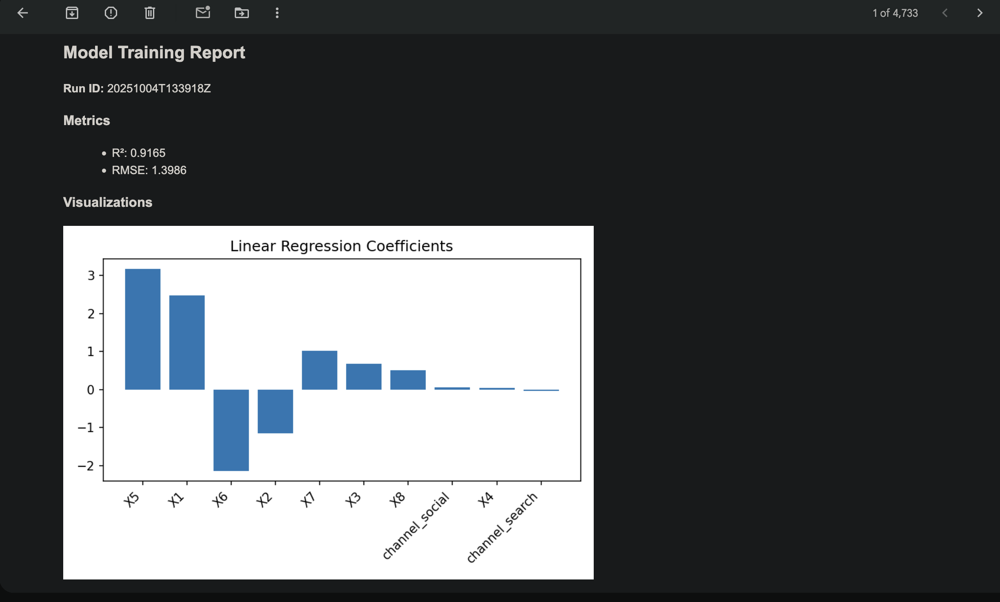
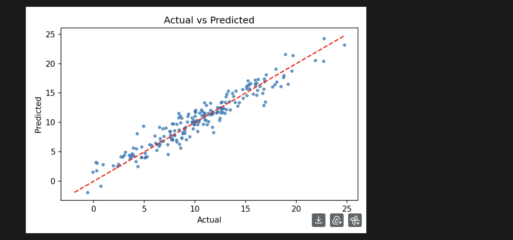
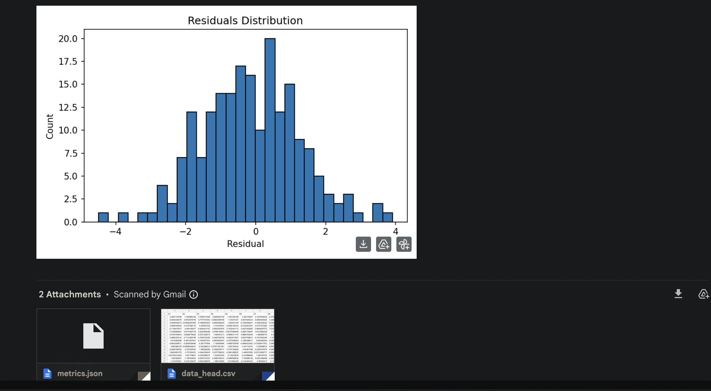
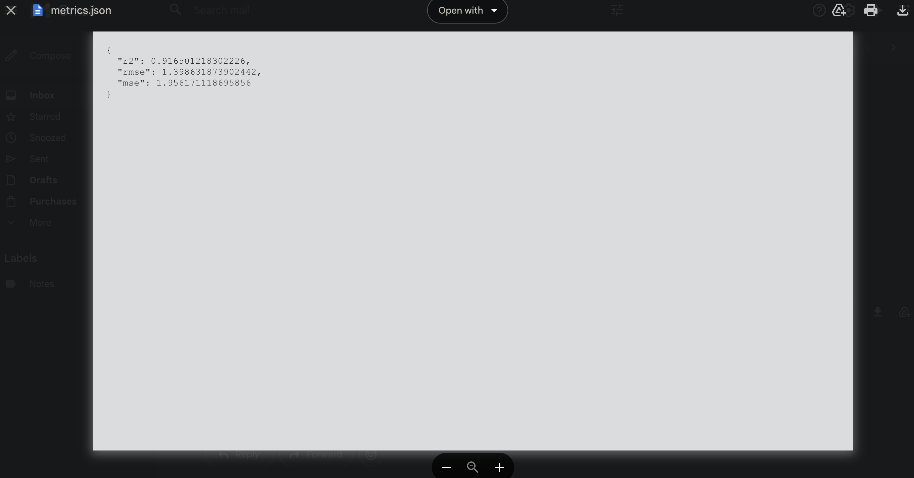

# Airflow Lab 2 – Automated Machine Learning Pipeline with Email Report

## Overview

This project implements a three-stage automated machine learning pipeline using Apache Airflow.  
It demonstrates an end-to-end MLOps workflow that:

1. Generates synthetic data  
2. Trains a Linear Regression model and produces metrics and visualizations  
3. Emails a full HTML report with inline charts and attachments  

The pipeline runs in the following sequence:

DAG 1 → DAG 2 → DAG 3

Once the first DAG is manually triggered, the rest execute automatically.  
This implementation is designed for Airflow version 2.7 and above, compatible with macOS and Gmail SMTP.

---

## Purpose

The purpose of this project is to demonstrate how Apache Airflow can be used for automating MLOps workflows such as:

- Data generation and preparation  
- Model training and evaluation  
- Automated report creation  
- Automatic email notifications  

It simulates a real-world scenario where new data is generated, a model is retrained, performance metrics are captured, and the results are shared automatically via email.

---

## Data Description

Each time the pipeline runs, a new synthetic dataset is generated automatically.

The dataset contains:
- 1000 rows  
- 10 columns  

The columns include:
- 8 numeric features (X1 to X8)
- 1 categorical feature called "channel" which randomly takes one of the values: "search", "social", or "display"
- 1 target variable "sales"

The target "sales" is computed from a hidden linear combination of the numeric features plus random noise.  
This setup mimics a regression-style dataset similar to predicting sales, revenue, or advertising outcomes.

---

## Model Description

The model used is a Linear Regression model implemented using scikit-learn.

The following preprocessing and training steps are performed:

- The categorical feature "channel" is one-hot encoded  
- The data is split into 80% training and 20% testing sets  
- The model is trained on the training set  
- After training, the model is evaluated using:
  - R² (Coefficient of Determination): measures how well the model explains the variance in the target  
  - MSE (Mean Squared Error): measures the average squared error between predictions and actual values  
  - RMSE (Root Mean Squared Error): provides a more interpretable metric in the same scale as the target  

All results, model metrics, and visualizations are stored for each pipeline run.

---

## Generated Visualizations and Reports

After training, the system generates several plots and reports automatically:

1. Feature Coefficients – bar chart showing the magnitude and sign of each feature's coefficient  
2. Actual vs Predicted – scatter plot showing how well the model predictions align with true values  
3. Residuals Histogram – visualization showing the distribution of prediction errors  

All outputs are saved in a timestamped folder under `src/reports/`.

Example directory structure for one run:

```bash
src/reports/20251004T021030Z/
├── coefficients.png
├── actual_vs_pred.png
├── residuals.png
├── metrics.json
├── data_head.csv
└── report.html
```


Example metrics file (metrics.json):
```bash
{
"r2": 0.965,
"rmse": 1.023,
"mse": 1.046
}
```


---

## Technology Stack

The main technologies used in this project are:

- Apache Airflow (version 2.7 or later) for workflow orchestration  
- Python 3.12 as the runtime environment  
- scikit-learn for Linear Regression model training and evaluation  
- pandas and numpy for data manipulation  
- matplotlib with Agg backend for non-GUI visualizations (macOS compatible)  
- Gmail SMTP for email automation  
- joblib for model serialization and storage  
- Airflow TriggerDagRunOperator and XCom for DAG communication  

---

## Project Structure

```bash
Airflow_labs/
│
├── dags/
│ ├── dag1_generate_data.py # Generates dataset & triggers DAG 2
│ ├── dag2_train_model.py # Trains model & triggers DAG 3
│ └── dag3_email_report.py # Sends email with report & plots
│
├── src/
│ ├── model_development.py # Data generation, training, evaluation, reporting
│ ├── utils/
│ │ ├── paths.py # File path constants
│ │ └── email_utils.py # Gmail SMTP email sender
│ ├── data/ # Stores dataset.csv
│ ├── models/ # Stores model.pkl
│ └── reports/ # Timestamped run folders (metrics, charts, html)
│
├── airflow.cfg # Airflow + SMTP configuration
├── requirements.txt
└── README.md
```


---

## DAG Descriptions

### DAG 1 – dag1_generate_data

- Generates a synthetic dataset with 1000 rows and 10 columns  
- Saves it to `src/data/dataset.csv`  
- Automatically triggers DAG 2  

### DAG 2 – dag2_train_model

- Loads the dataset generated by DAG 1  
- Trains a Linear Regression model  
- Calculates metrics including R², RMSE, and MSE  
- Generates plots:
  - coefficients.png  
  - actual_vs_pred.png  
  - residuals.png  
- Saves:
  - metrics.json  
  - report.html  
  - data_head.csv  
- Automatically triggers DAG 3  

### DAG 3 – dag3_email_report

- Reads the report directory passed from DAG 2  
- Composes and sends an HTML email with:
  - Inline images (plots)  
  - Attachments (metrics.json, data_head.csv)  
- Uses Gmail SMTP to send the email  

From: sriks071@gmail.com
to: sriks071@gmail.com


---

## Airflow Configuration and Setup

### 1. Set Airflow Home Directory

export AIRFLOW_HOME=/Users/sriks/Documents/Projects/MLOps_Submissions/Labs/Lab_2/Airflow_labs


### 2. Initialize the Airflow Database

airflow db migrate


(If using Airflow older than version 2.7, use `airflow db init` instead.)

### 3. Configure SMTP for Email Notifications

Edit your `airflow.cfg` and include the following:

[email]
email_backend = airflow.utils.email.send_email_smtp

[smtp]
smtp_host = smtp.gmail.com
smtp_starttls = True
smtp_ssl = False
smtp_user = sriks071@gmail.com


### 4. Start Airflow Services

airflow standalone


Airflow UI at: http://localhost:8080/


---

## Common Airflow Commands

To stop all running Airflow processes:

pkill -f airflow


To remove old DAG runs:
airflow dags delete <dag_id>
airflow db clean


To completely reset Airflow:
pkill -f airflow
rm -rf $AIRFLOW_HOME/airflow.db $AIRFLOW_HOME/logs
airflow db migrate


---

## Internal Workflow Explanation

1. Data Generation

generate_synthetic_dataset(rows=1000, seed=42)


Generates 1000 samples with numeric and categorical features, creating a regression-style dataset.

2. Model Training


Trains a Linear Regression model, computes metrics (R², MSE, RMSE), and saves results to `src/reports/<timestamp>/`.

3. Email Sending

send_email_gmail(
subject="[Airflow Lab 2] Model Report",
html_body=html,
attachments=[metrics.json, data_head.csv],
inline_images=[coefficients.png, actual_vs_pred.png, residuals.png]
)


Sends a formatted HTML email with inline visualizations and file attachments.

---

## Example Output Folder

Every run creates a timestamped report directory under `src/reports/`.

```bash
src/reports/20251004T021030Z/
├── coefficients.png
├── actual_vs_pred.png
├── residuals.png
├── metrics.json
├── data_head.csv
└── report.html
```


---

## DAG Workflow Diagram

```mermaid
flowchart TD
    A["DAG 1: Generate Data"] --> B["DAG 2: Train Model"]
    B --> C["DAG 3: Email Report"]

Each DAG triggers the next one automatically using Airflow’s TriggerDagRunOperator.


Results and Outcomes

After the pipeline runs:

A synthetic dataset is generated and stored.

A Linear Regression model is trained.

Metrics and visualizations are produced.

A report folder is created under src/reports/.

An automated email is sent to sriks071@gmail.com containing:

Model metrics

Inline plots

CSV and JSON attachments

The entire workflow requires only one manual trigger (DAG 1). The rest runs automatically.


Key Features

Fully automated machine learning lifecycle from data to email

End-to-end DAG chaining and orchestration using Airflow

Automatic report generation and timestamped versioning

Inline email visualizations and attached results

Gmail SMTP integration

macOS-compatible plotting using Agg backend

Cross-DAG communication via Airflow conf and XCom


Example Email Output





