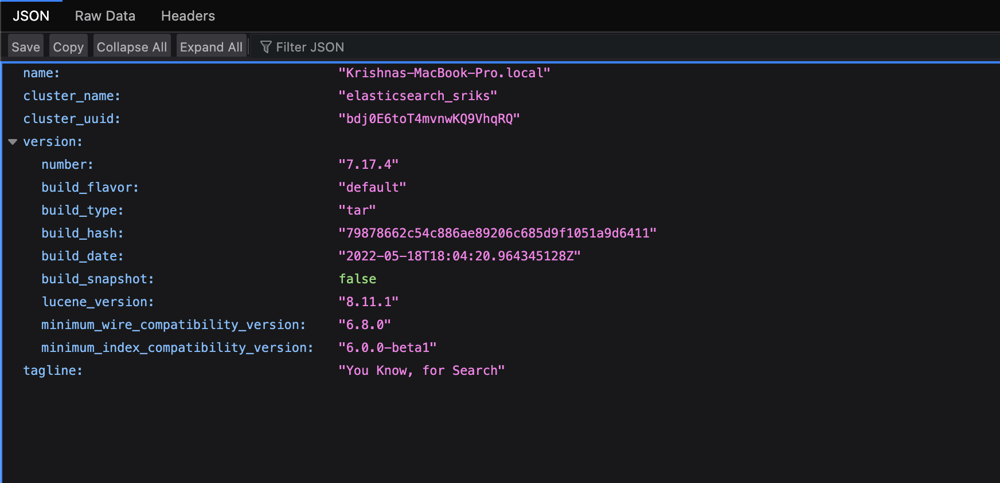
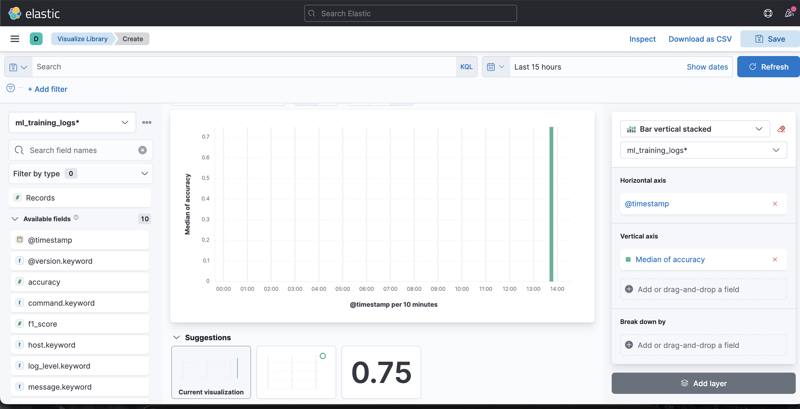
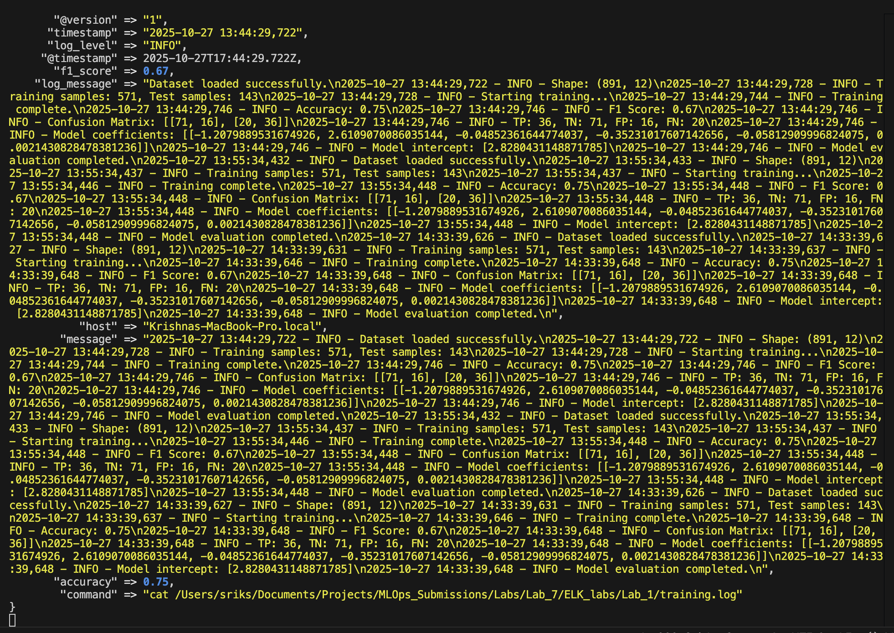

    # Machine Learning Training Log Monitoring using ELK Stack

This project demonstrates how to monitor machine learning training logs in real time using the ELK stack (Elasticsearch, Logstash, and Kibana). The pipeline captures training metrics such as accuracy and F1 score from a log file, parses them using Logstash, stores them in Elasticsearch, and visualizes them in Kibana dashboards.

## 1. Overview

### Objective
The goal of this project is to stream machine learning training logs into Elasticsearch and visualize model performance metrics such as accuracy and F1 score using Kibana.

### Workflow
1. A Python script (`train_titanic_model.py`) trains a model and writes logs into `training.log`.
2. Logstash reads and parses the logs using a Grok filter.
3. Elasticsearch indexes the structured data.
4. Kibana visualizes the metrics in interactive dashboards.

## 2. Directory Structure

```
Lab_1/
│
├── train_titanic_model.py      # Python model training script
├── logstash.conf               # Logstash configuration file
├── training.log                # Generated training log
└── README.md                   # Project documentation
```

## 3. Setup Instructions

### Prerequisites
- macOS or Linux
- Homebrew
- Python 3.8 or higher
- Java 17
- ELK Stack (Elasticsearch, Logstash, Kibana)

### Step 1. Install Elasticsearch and Kibana

```bash
brew tap elastic/tap
brew install elastic/tap/elasticsearch-full
brew install elastic/tap/kibana-full
```

Start Elasticsearch:
```bash
elasticsearch
```

Start Kibana:
```bash
kibana
```

Access Kibana:
```
http://localhost:5601
```

### Step 2. Install Logstash

```bash
cd ~
wget https://artifacts.elastic.co/downloads/logstash/logstash-7.17.4-darwin-aarch64.tar.gz
tar -xvzf logstash-7.17.4-darwin-aarch64.tar.gz
mv logstash-7.17.4 logstash
```

Verify installation:
```bash
~/logstash/bin/logstash --version
```

## 4. Training Script

Save this as `train_titanic_model.py`:

```python
import logging
from sklearn.datasets import load_iris
from sklearn.linear_model import LogisticRegression
from sklearn.model_selection import train_test_split
from sklearn.metrics import accuracy_score, f1_score

logging.basicConfig(
    filename='training.log',
    level=logging.INFO,
    format='%(asctime)s - %(levelname)s - %(message)s'
)

logging.info("Dataset loading...")
data = load_iris()
X, y = data.data, data.target

X_train, X_test, y_train, y_test = train_test_split(X, y, test_size=0.2, random_state=42)
logging.info(f"Shape: {X_train.shape}, {X_test.shape}")
logging.info(f"Training samples: {len(X_train)}, Test samples: {len(X_test)}")

logging.info("Starting training...")
model = LogisticRegression(max_iter=200)
model.fit(X_train, y_train)

predictions = model.predict(X_test)
accuracy = accuracy_score(y_test, predictions)
f1 = f1_score(y_test, predictions, average='weighted')

logging.info("Training complete.")
logging.info(f"Accuracy: {accuracy:.2f}")
logging.info(f"F1 Score: {f1:.2f}")
```

Run it:
```bash
python train_titanic_model.py
```

## 5. Logstash Configuration

Create a file named `logstash.conf`:

```ruby
input {
  exec {
    command => "cat /Users/sriks/Documents/Projects/MLOps_Submissions/Labs/Lab_7/ELK_labs/Lab_1/training.log"
    interval => 5
  }
}

filter {
  grok {
    match => { "message" => "%{TIMESTAMP_ISO8601:timestamp} - %{LOGLEVEL:log_level} - %{GREEDYDATA:log_message}" }
  }

  grok {
    match => { "log_message" => "Accuracy: %{NUMBER:accuracy:float}.*F1 Score: %{NUMBER:f1_score:float}" }
    tag_on_failure => []
  }

  date {
    match => ["timestamp", "ISO8601"]
    target => "@timestamp"
  }
}

output {
  elasticsearch {
    hosts => ["http://localhost:9200"]
    index => "ml_training_logs"
  }
  stdout { codec => rubydebug }
}
```

## 6. Run Logstash

```bash
cd ~/logstash
bin/logstash -f /Users/sriks/Documents/Projects/MLOps_Submissions/Labs/Lab_7/ELK_labs/Lab_1/logstash.conf
```

When you see:
```
Pipeline started {"pipeline.id"=>"main"}
```
Logstash is running successfully.

## 7. Visualize Logs in Kibana

1. Open Kibana: http://localhost:5601  
2. Go to **Stack Management → Index Patterns**
3. Create a new index pattern: `ml_training_logs*`
4. Set `@timestamp` as the time filter field
5. Go to **Discover**, select the index pattern, and set time to **Last 24 hours**
6. You should now see parsed logs and extracted fields: accuracy, f1_score, log_message, and timestamp.

## 8. Visualization Dashboard

1. Open **Analytics → Visualize Library**
2. Click **Create Visualization → Line Chart (Lens)**
3. Select index: `ml_training_logs*`
4. Drag fields:
   - `@timestamp` → X-axis  
   - `accuracy` → Y-axis (Average)  
   - `f1_score` → Y-axis (Average)
5. Click **Save** and name it `Model Training Metrics`

### Create a Dashboard
1. Go to **Analytics → Dashboard → Create new dashboard**
2. Click **Add from library** and select your saved visualization
3. Save the dashboard as `ML Training Monitoring`

## 9. Troubleshooting

**Issue: Logstash already running**
```bash
ps aux | grep logstash
kill -9 <PID>
```

**Issue: No results in Kibana**
- Ensure the correct time range (Last 24 hours)
- Run the training script again
- Refresh Kibana fields

**Issue: Parsing errors**
Check Grok syntax using https://grokdebug.herokuapp.com/

## 10. Summary

This project builds an end-to-end ML log monitoring system using the ELK stack. It helps visualize model training progress and performance metrics in real time. The setup can be extended to monitor other experiments, model versions, or pipeline runs.


## Elastic Search "Dashboard"



## Kibana Dashboard



## Lagstash




